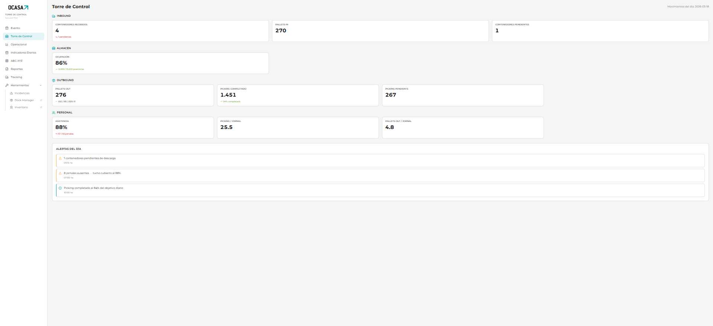
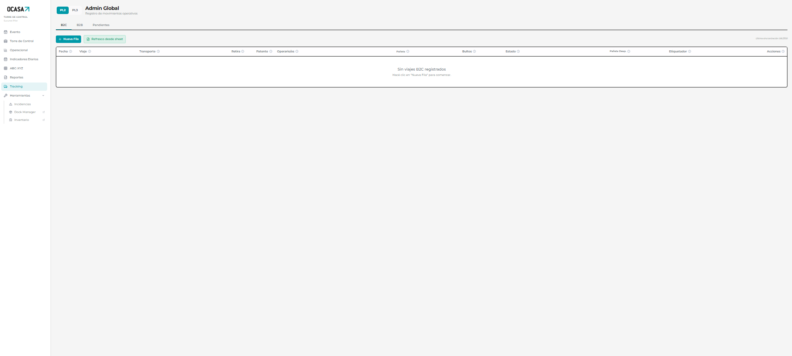
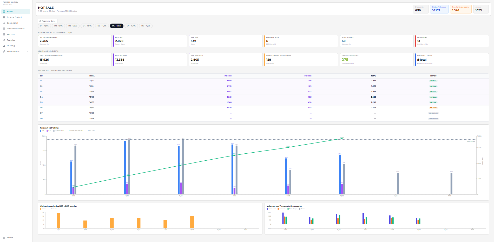

# Sistema de Gestión Pilar

Plataforma integral de gestión de warehouse con IA que centraliza operaciones, logística y atención al cliente. Permite monitoreo en tiempo real, gestión de reclamos y trazabilidad completa de envíos mediante un chatbot inteligente.

## Funcionalidades principales

Dashboard operativo con KPIs en tiempo real, estado de docks y movimientos de inventario (OTIF). Tracking completo de viajes con estados y trazabilidad. CRM de reclamos con ingreso automático desde emails vía IA. Chatbot IA para consultas operativas. Panel financiero protegido con contraseña adicional. Mapa 2D interactivo del warehouse. Generación y exportación de reportes configurables.

## Capturas

**Torre de Control**


**Tracking de viajes**


**Seguimiento de eventos (ej. Hot Sale)**


## Roles y permisos

Sistema de cuatro roles (operativo, supervisor, gerencial, admin) con una matriz de permisos granular por módulo.

## Stack tecnológico

Frontend: Next.js 14 (App Router), TypeScript, Tailwind CSS, shadcn/ui, Zustand, React Hook Form + Zod, TanStack Table, Recharts, React Konva.

Backend: Next.js API Routes, Supabase (PostgreSQL, Auth con Google OAuth, Realtime, Storage), OpenAI GPT-4 / Claude API.

## Instalación

```bash
git clone <url-del-repo>
cd sistema-de-gestion-pilar
pnpm install
cp .env.example .env.local
# completar las variables de entorno (Supabase, IA, email)
pnpm dev
```

## Estado del proyecto

En desarrollo activo, desplegado en producción.
